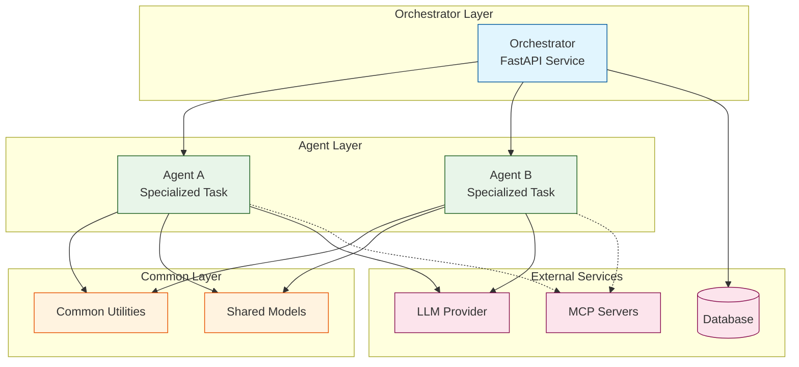
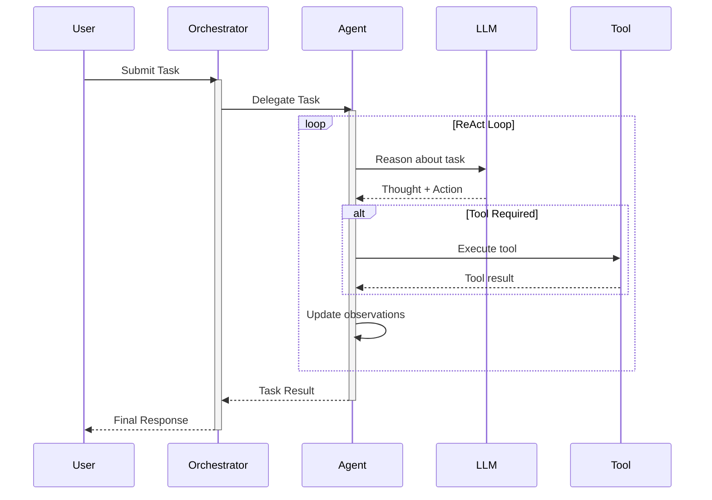
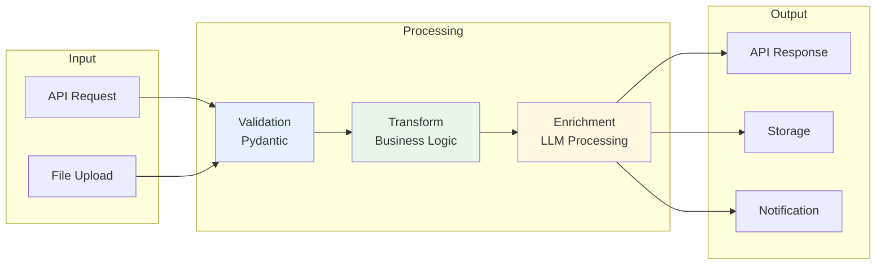
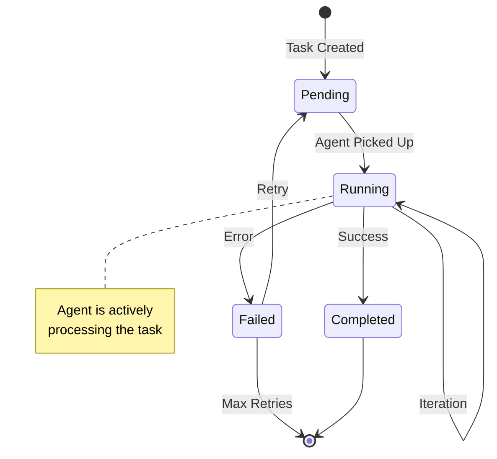
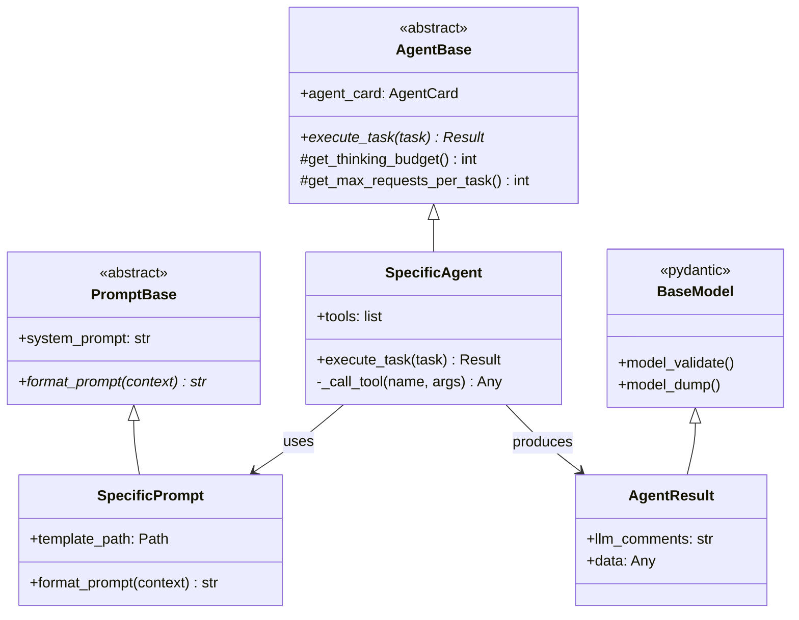
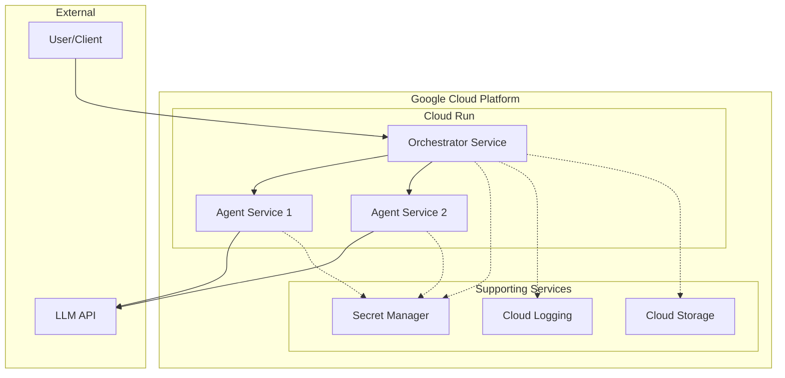
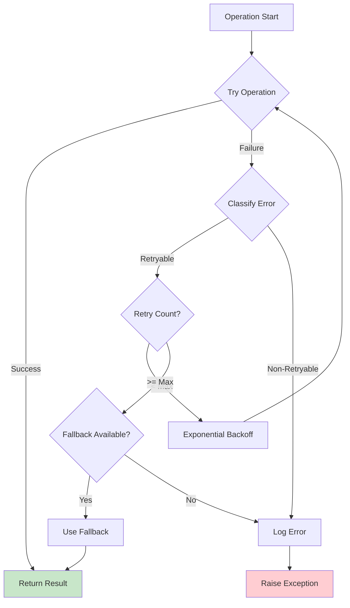

# Mermaid Diagram Templates

This file contains templates for common architecture diagrams used in implementation plans.

---

## Component Diagram

Use for showing modules, their responsibilities, and dependencies.

---

## Sequence Diagram

Use for showing interactions between components over time.

---

## Data Flow Diagram

Use for showing how data moves through the system.

---

## State Machine Diagram

Use for showing agent or task states and transitions.

---

## Class Diagram

Use for showing class relationships and inheritance.

---

## Deployment Diagram

Use for showing infrastructure and deployment topology.

---

## Error Handling Flow

Use for showing how errors propagate and are handled.

---

## Usage Notes

1. **Copy the diagram that fits your use case**
2. **Modify labels and connections** to match your implementation
3. **Keep diagrams focused** - one concern per diagram
4. **Use consistent styling** with the `classDef` and `style` directives
5. **Test in a Mermaid renderer** before including in the plan

### Mermaid Live Editor

Test diagrams at: https://mermaid.live/
