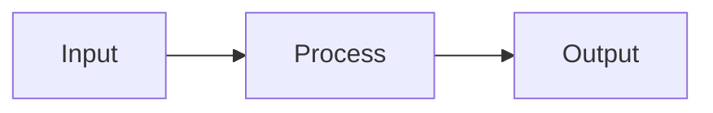
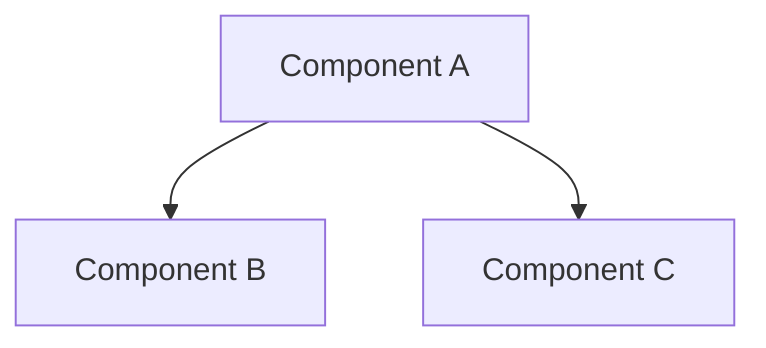

# Implementation Plan: [Feature Name]

## 1. Overview

| Field                 | Value                                                       |
|-----------------------|-------------------------------------------------------------|
| **Goal**              | [Brief description of what we are building]                 |
| **Status**            | [Draft / Under Review / Approved / In Progress / Completed] |
| **Author**            | [Name/Agent]                                                |
| **Date Created**      | [YYYY-MM-DD]                                                |
| **Target Completion** | [YYYY-MM-DD or Sprint X]                                    |

### Drift from Original Request

[Note any changes from the original user request and why they were made]

---

## 2. Research & Analysis

### 2.1 Current State Analysis

[Describe the existing code/architecture relevant to this change]

**Existing components to modify:**

- [Component 1]: [Current responsibility]
- [Component 2]: [Current responsibility]

**Code to reuse:**

- [Module/Function]: [What we can reuse]

### 2.2 Web Research Findings

| Source              | Topic   | Key Learning  | Applied To         |
|---------------------|---------|---------------|--------------------|
| [Official Docs URL] | [Topic] | [Key finding] | [How it's applied] |
| [Official Docs URL] | [Topic] | [Key finding] | [How it's applied] |

### 2.3 Tech Stack Alignment

| Technology | Version   | How It Fits     |
|------------|-----------|-----------------|
| Python     | 3.12+     | [Usage details] |
| FastAPI    | [version] | [Usage details] |
| Pydantic   | V2        | [Usage details] |
| [Other]    | [version] | [Usage details] |

### 2.4 GEMINI.md Compliance

[List specific rules from GEMINI.md that apply and how they will be followed]

- ✅ [Rule 1]: [How it's applied]
- ✅ [Rule 2]: [How it's applied]

---

## 3. Architecture Design

### 3.1 Design Patterns Used

| Pattern          | Purpose              | Location             |
|------------------|----------------------|----------------------|
| [e.g., Factory]  | [Why we're using it] | [Where it's applied] |
| [e.g., Strategy] | [Why we're using it] | [Where it's applied] |

### 3.2 Components

| Component     | Responsibility | New/Modified |
|---------------|----------------|--------------|
| [Component A] | [What it does] | New          |
| [Component B] | [What it does] | Modified     |

### 3.3 Data Flow

[Describe how data moves between components, or include a Mermaid diagram]



### 3.4 Component Diagram

[Include a Mermaid component diagram showing module dependencies]



---

## 4. Security Considerations

### 4.1 Threat Analysis

| Threat     | Likelihood      | Impact          | Mitigation   |
|------------|-----------------|-----------------|--------------|
| [Threat 1] | Low/Medium/High | Low/Medium/High | [Mitigation] |
| [Threat 2] | Low/Medium/High | Low/Medium/High | [Mitigation] |

### 4.2 Security Controls

- [ ] Input validation via Pydantic
- [ ] Secrets managed via environment variables
- [ ] Principle of least privilege applied
- [ ] [Other controls]

### 4.3 Data Handling

- **Sensitive data types:** [List any PII, secrets, etc.]
- **Protection measures:** [Encryption, masking, etc.]

---

## 5. Performance Requirements

### 5.1 Performance Targets

| Metric              | Target            | Measurement Method |
|---------------------|-------------------|--------------------|
| Response time (p95) | [e.g., < 500ms]   | [How to measure]   |
| Throughput          | [e.g., 100 req/s] | [How to measure]   |
| Memory usage        | [e.g., < 512MB]   | [How to measure]   |

### 5.2 Scalability Approach

- [ ] Async implementation for I/O-bound operations
- [ ] Connection pooling configured
- [ ] Caching strategy: [Description]
- [ ] Horizontal scaling considerations: [Description]

### 5.3 Performance Risks

| Risk     | Mitigation   |
|----------|--------------|
| [Risk 1] | [Mitigation] |

---

## 6. Proposed Changes

### 6.1 File Structure Changes

```text
project_root/
├── [existing_folder/]
│   ├── modified_file.py      # [What changes]
│   └── new_file.py           # [New - purpose]
├── [new_folder/]             # [New - purpose]
│   └── __init__.py
└── ...
```

### 6.2 New Dependencies

| Package   | Version   | Purpose      | License   | Security Check     |
|-----------|-----------|--------------|-----------|--------------------|
| [package] | [version] | [why needed] | [license] | ✅ pip-audit passed |

### 6.3 API / Interface Changes

#### New Endpoints/Functions

```python
async def new_function(arg: str) -> Result:
    """[Description]"""
    ...
```

#### Data Models (Pydantic)

```python
class NewModel(BaseModel):
    """[Description]"""
    field_1: str
    field_2: int | None = None
```

### 6.4 Configuration Changes

| Config Key | Type | Default   | Description   |
|------------|------|-----------|---------------|
| [KEY_NAME] | str  | [default] | [Description] |

---

## 7. Implementation Steps

### Step 1: [Step Name]

**Description:** [What to do]
**Files affected:** [List files]
**Verification:** [How to verify this step is working]
**Estimated effort:** [e.g., 1 hour]

### Step 2: [Step Name]

**Description:** [What to do]
**Files affected:** [List files]
**Verification:** [How to verify this step is working]
**Estimated effort:** [e.g., 2 hours]

### Step 3: [Step Name]

...

---

## 8. Testing Strategy

### 8.1 Unit Tests

| Test Case     | Description     | Module      |
|---------------|-----------------|-------------|
| `test_[name]` | [What it tests] | [module.py] |
| `test_[name]` | [What it tests] | [module.py] |

### 8.2 Integration Tests

| Test Case     | Components Tested | Setup Required |
|---------------|-------------------|----------------|
| `test_[name]` | [Components]      | [Setup steps]  |

### 8.3 Edge Cases

- [ ] [Edge case 1]: [How it's handled]
- [ ] [Edge case 2]: [How it's handled]
- [ ] Error scenarios: [List]

### 8.4 Test Commands

```bash
# Run unit tests
pytest tests/[path] -v

# Run with coverage
pytest tests/[path] --cov=[module] --cov-report=term-missing -v
```

---

## 9. Observability

### 9.1 Logging

| Log Point  | Level | Content         |
|------------|-------|-----------------|
| [Location] | INFO  | [What's logged] |
| [Location] | ERROR | [What's logged] |

### 9.2 Metrics (if applicable)

| Metric        | Type                    | Description        |
|---------------|-------------------------|--------------------|
| [metric_name] | Counter/Gauge/Histogram | [What it measures] |

### 9.3 Alerts (if applicable)

| Alert        | Condition           | Action            |
|--------------|---------------------|-------------------|
| [Alert name] | [Trigger condition] | [Response action] |

---

## 10. Migration & Rollback Plan

### 10.1 Migration Steps

[If applicable, describe how to migrate data or state]

1. [Step 1]
2. [Step 2]

### 10.2 Rollback Plan

[How to revert changes if something goes wrong]

1. [Rollback step 1]
2. [Rollback step 2]

### 10.3 Breaking Changes

| Change   | Impact                 | Migration Path   |
|----------|------------------------|------------------|
| [Change] | [Who/what is affected] | [How to migrate] |

---

## 11. Definition of Done

### Code Complete

- [ ] All implementation steps completed
- [ ] Code follows GEMINI.md guidelines
- [ ] Type hints added for all public interfaces
- [ ] Docstrings added for all public modules/classes/functions

### Quality Gates

- [ ] `ruff check .` passes
- [ ] `ruff format . --check` passes
- [ ] `pytest tests/ -v` passes
- [ ] `bandit -r . -x ./tests,./.venv` has no high/medium issues
- [ ] `pip-audit` has no critical vulnerabilities

### Documentation

- [ ] README.md updated if needed
- [ ] Relevant skills updated if needed
- [ ] ADR created for significant decisions

### Review

- [ ] Code reviewed by peer or user
- [ ] Changes approved for merge

---

## 12. Architecture Decision Records

[Link to ADRs created for this implementation]

- [ADR-XXX: Decision Title](path/to/adr.md)

---

## 13. References

- [Link to relevant documentation]
- [Link to related issues/PRs]
- [Link to external resources used]

---

## Appendix A: Detailed Diagrams

[Include additional diagrams here if needed]

## Appendix B: Research Notes

[Include detailed research notes here if needed]
