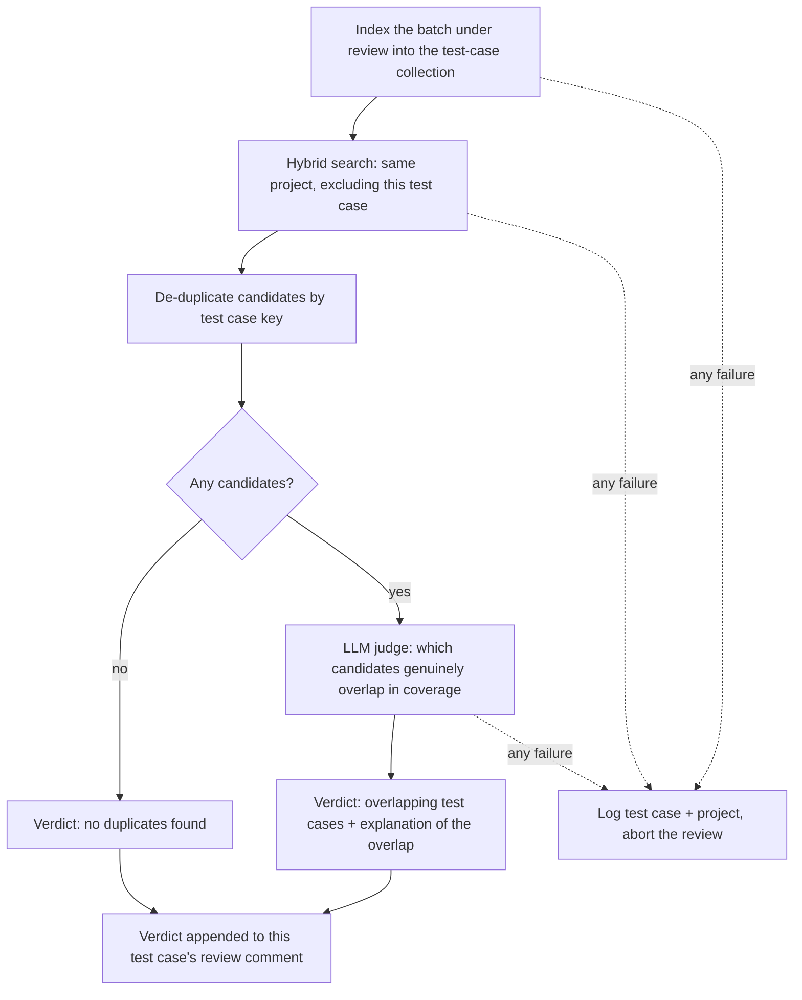

# Implementation Plan 2: Platform Hardening, Observability and Multi-Source RAG

## Goal

This plan covers every feature and fix from the second change request that the codebase does not implement yet. It
**builds on `IMPLEMENTATION_PLAN.md`** ("Plan 1"): Plan 1's workstreams WS1–WS11 are treated as prerequisites, this plan
continues the numbering with **WS12–WS27**, and it only specifies what Plan 1 does not already describe. Where this plan
needs Plan 1 to be built slightly differently, that is listed once under *Adjustments to Plan 1* instead of being
re-specified later.

The plan describes architecture, responsibilities, data contracts and decision logic. Libraries, function signatures and
the code structure inside a module are left to the implementer, within the constraints stated here.

Already implemented, so not planned again (verified in the code):

- Active health checking of registered agents, and discovery narrowed to finding new agents (`orchestrator/main.py`).
- Agents executing a task are never removed from the registry (no removal path exists today).
- Task descriptions carry the concrete Jira key.
- Two-source duplicate detection with a single judging call (incident prompt steps 1.1–1.3, `_check_all_duplicates`).
- Jira ingestion through the native REST client (`common/services/rag_sync_service.py`).
- The dashboard's fallback log-level detector for non-Python log formats.
- Test cases reviewed one at a time inside a single tool call (`agents/test_case_review/main.py`).
- Self-healing Jira MCP sessions (the redesign of *how* they heal is WS21).
- Removal of the default `admin/admin` dashboard credentials (the bcrypt hash is WS22).

Deviations from the request, each explained where it applies:

- **Three-cloud deployment** is reduced to a platform-neutral manifest with a **GCP-only renderer** (user decision).
- **Test-case duplicate verdicts** are appended to the test case's own review comment, not posted as a separate comment
  (user decision).
- **The manual single-test endpoint** is built but stays unused until an attended execution agent is deployed (user
  decision). It carries a project key, because it uploads its result to the test management system.
- **Login rate limiting** implements the application layer only; the request's "second layer" is infrastructure
  (an external load balancer with Cloud Armor), which the current deployment does not have.

## How to use this plan

- "Must" marks a binding requirement, "recommended" marks a preferred option the implementer may replace with a
  justified alternative, "implementer decides" marks a free technical choice.
- File paths under *Changes* are indicative: they show where a responsibility belongs, not a required layout.
- Every phase under *Steps* is one reviewable change including its unit tests, smoke coverage, CALM update and docs, as
  `AGENTS.md` requires.

## Decisions already made

| Topic                          | Decision                                                                                                              |
|--------------------------------|-----------------------------------------------------------------------------------------------------------------------|
| Relation to Plan 1             | Build on it. Plan 1 ships first (or in the interleaved order under *Steps*); this plan specifies only the deltas.      |
| Deployment manifest scope      | One platform-neutral manifest; the renderer implements the **Google Cloud** target only. Azure/AWS pipelines are out of scope. |
| Test-case duplicate reporting  | The verdict is appended to that test case's own review comment. No separate comment.                                  |
| Manual single-test execution   | The endpoint is built now, runs one test case on an explicitly chosen agent, and never creates incidents.              |
| Confluence/SharePoint ingestion| In scope, built from scratch (Confluence in Plan 1 WS9, SharePoint here in WS18).                                      |
| pydantic-ai upgrade            | Allowed and evaluated in its own phase (WS12, phase A0) instead of being worked around.                                |

## Assumptions and open questions

Assumptions (proceed on these unless overridden):

1. **Claude 5 family** means `claude-opus-5` and `claude-sonnet-5` (the models the framework would realistically use).
   The Fable/Mythos 5 models are handled defensively (they reject disabled thinking) but are not a target.
2. **Per-operation token accounting** covers LLM calls made *inside an agent run* (the main agent and its sub-agents).
   The orchestrator's own routing/extraction calls keep their existing one-line usage log and are not metered as
   operations.
3. **The manual execution endpoint** uploads its single result to the test management system and regenerates the report
   (this is exactly the concurrency the report lock exists for), but never creates incidents.
4. **The project key** reaches incident creation from the batch endpoint only, because manual runs create no incidents.
5. **Test-case indexing** is a per-project full resync; the Test Case Review agent additionally indexes the batch it is
   reviewing, so a review can see test cases created minutes earlier.
6. **SharePoint scope** is document libraries (drive items). SharePoint site pages (`.aspx`) are not ingested.
7. **Dashboard state** is persisted in the vector database, reusing Plan 1's metadata-collection mechanism (payload-only
   records that never call the embedding service).
8. **One orchestrator instance** (`--max-instances=1`, in-memory registry) remains true, so in-process locks and an
   in-process rate limiter are sufficient.

Open questions, each with a recommendation. Confirm before or during implementation:

1. **pydantic-ai upgrade (WS12).** Recommended: upgrade to the 2.x line in phase A0 after the compatibility spike
   passes. It brings native Claude 5 handling, the supported MCP Streamable HTTP client and the retry transport, and
   removes roughly half of WS12/WS21's manual work. If the spike fails (a2a-sdk, `mcp` 2.x/httpx2 or Qwen provider
   incompatibility), stay on 1.89.0 and implement the explicit settings path described in WS12.
2. **Eligible test-case statuses (WS17).** Recommended default: empty = index every status, with the README recommending
   an explicit list that excludes deprecated/obsolete statuses.
3. **Disabled thinking on Claude Opus 5 (WS12).** The request asks for thinking to be switched off explicitly when an
   agent has reasoning off. Anthropic documents that Opus 5 with thinking disabled occasionally writes a tool call into
   visible text instead of a `tool_use` block. Recommended: implement as asked, but document the pitfall and keep
   `low` effort (thinking on) as the recommended production setting for "cheap" agents.
4. **Persisted log level (WS24).** Recommended: persist every line the dashboard's in-memory buffer accepts (its noise
   filter already excludes library loggers), batched. If volume is a problem, add a minimum level setting later.
5. **Merging retrieval results across sources (WS18).** Recommended: rank interleaving, because fused RRF scores are not
   comparable across collections. Alternative: sort by the dense similarity score, which is comparable when both
   collections use the same embedding model.

## Adjustments to Plan 1

Apply these while implementing Plan 1, so nothing is built twice:

| Plan 1 element | Adjustment |
|----------------|------------|
| WS3 prompt overrides | Prompt templates are Markdown `.md` files (WS27). Override paths therefore use `.md`. Placeholder validation must tolerate escaped braces (`{{`, `}}`) used by JSON examples inside Markdown prompts. |
| WS1 routing | The execution-agent selection prompt carries the unattended-CI/CD wording from WS15. |
| WS6 embedding service | The recorded "model identity" is extended to a full **embedding mode** descriptor (which named vectors exist: dense, sparse, optional visual), used by WS19's schema validation. |
| WS7 collections | The documents collection becomes **per source**: `QDRANT_CONFLUENCE_COLLECTION_NAME` (Plan 1's documents collection, default `confluence_documents`) and, in WS18, `QDRANT_SHAREPOINT_COLLECTION_NAME`. Every query pins a `source` payload discriminator even though the collection already implies it. Add the `test_cases` collection (WS17). |
| WS7 search | Drop the pre-flight `_collection_exists()` round trip and handle a missing collection from the query's own 404 (WS19). `VectorDbService.close()` must also close the Qdrant client (WS19). |
| WS8 Jira sync | Do **not** port the status allow-list: every issue is ingested regardless of status (WS18). `JIRA_VALID_STATUSES` disappears. |
| WS8 endpoints | Add `/update-sharepoint-db` (WS18) and `/update-test-case-db` (WS17) with the same accepted/conflict semantics. |
| WS8 lock & state | Add the per-scope **sync outcome record** from the start (WS20): the trigger writes `running` before the job starts, a definite start failure writes `failed`. Releasing a lock when the metadata collection does not exist is a no-op, not an error. |
| WS9 ingestion pipeline | Extraction, conversion, rendering, OCR, chunking and the page-record shape must be **source-agnostic** (a Confluence attachment and a SharePoint file are the same kind of input), so WS18 reuses them unchanged. |
| WS10 retrieval | The scope model has no `source` field; sources are enabled independently and queried concurrently (WS18). The configured minimum similarity score must actually reach the dense prefetch (WS19). |
| WS11 MCP | Deploy and connect the combined Atlassian MCP over **stateless Streamable HTTP** from the start, with `/mcp` as the default path (WS21). |
| WS11 / cloudbuild | Service configuration comes from the rendered manifest (WS26); sizing, ports, image tags and request timeouts stay in `cloudbuild.yaml`. |

## Current state and reuse

| Existing element | Today | Reuse / change |
|------------------|-------|----------------|
| `common/model_factory.py` | Resolves a model name and builds Qwen-specific settings (effort map, explicit thinking-off, Cloud Run identity auth). | The single place where provider-specific settings are resolved; extended with the Claude 5 path and the max-output-tokens setting (WS12). |
| `common/custom_llm_wrapper.py` | Wraps every model call; always sets `top_p`/`temperature`, adds `thinking` when configured; logs requests/responses. | Sampling settings become provider-dependent (WS12); the wrapper is the capture point for per-operation token metering (WS13). |
| `common/token_usage.py` `TokenUsage` | One flat per-run record with an estimated cost; `cache_read_tokens` captured but folded into `input_tokens`. | Extended with per-operation entries and an explicit cached/uncached split (WS13). |
| `common/agent_base.py` | Builds the agent, retries whole runs, captures usage, exposes the A2A card. | Agent-run retry stays; usage capture moves to the operation meter (WS13). |
| `common/agent_executor.py` | Per-task lifecycle: log capture handler in a ContextVar, activity streaming, artifacts, cancellation. | The place that opens/closes the per-task operation meter and stamps logging context (WS13, WS23). |
| `common/agent_log_capture.py`, `orchestrator/memory_log_handler.py` | Two handlers formatting `asctime - name - levelname - message` in local time; the dashboard handler stores the fully formatted line as the message. | Both switch to the shared structured formatter and UTC; the memory handler stores the bare message (WS23). |
| `orchestrator/dashboard_service.py` | Aggregates in-memory state; parses agent logs heuristically; naive local timestamps. | Reads structured fields first, keeps the heuristic parser as fallback; all timestamps UTC (WS23); gains the RAG-sync-status query (WS20). |
| `orchestrator/models.py` | In-memory `TaskHistory`, `ErrorHistory`, `AgentRegistry`; `ORCHESTRATOR_START_TIME`. | Registry gains URL-keyed find-or-create and the stored discovery URL (WS14); histories gain a write-through store and rehydration (WS24). |
| `orchestrator/main.py` discovery | `_process_url_discovery` skips known URLs, registers by advertised card URL, no locking; manual discovery reuses the periodic run. | Rewritten for atomic find-or-create, serialisation, discovered-address registration and the richer manual run (WS14). |
| `orchestrator/main.py` execution | `/execute-tests` groups by arbitrary labels, calls blocking TMS/report code on the loop, aborts on report failures, `queue.join()` can hang. | WS15. |
| `orchestrator/auth.py` | Plaintext constant-time password comparison, fail-closed when unconfigured. | bcrypt verification plus startup validation (WS22). |
| `agents/test_case_review/main.py` | Reviews one test case per sub-agent run inside one tool call; writes comment and status through TMS tools. | The duplicate check plugs into the same tool and the same comment (WS17). |
| `agents/incident_creation/main.py` | RAG duplicate search filtered by issue type and non-terminal status. | Adds the mandatory project filter (WS16); moves to Plan 1's hybrid query. |
| `common/services/vector_db_service.py` | Single dense vector, pre-flight existence check, HTTP client closed but Qdrant client leaked, embedding retries only on timeouts/connect errors. | WS19 (and Plan 1 WS7 for the schema). |
| `common/services/jira_mcp.py` | `MCPServerSSE` plus a self-healing wrapper that tears down and re-enters the *shared* session in place. | Transport and recovery redesign (WS21). |
| `common/services/test_management_base.py` + Zephyr/Xray clients | Blocking client methods used directly from async code. | Called through worker threads (WS15); extended with a project-wide test-case listing (WS17). |
| `common/services/allure_client.py` | Writes into fixed `allure-results`/`allure-report` directories; renders agent log lines into the report. | Serialised behind a lock (WS15); uses the shared log renderer (WS23). |
| `orchestrator/ui/**` | React dashboard: agents, tasks, errors, logs, live SSE. | Log modal fixes, discovery feedback, token detail, RAG sync panel, 429 message (WS25). |
| `cloudbuild.yaml` | Per-service `--set-env-vars` / `--set-secrets` spelled out inline; unconditional redeploys. | Consumes rendered configuration and a redeploy marker (WS26). |

## Research

| Source (official docs) | Finding | Applied to |
|------------------------|---------|------------|
| Anthropic API reference (bundled `claude-api` skill, cached 2026-06-24) | Claude Opus 5 / Sonnet 5: `budget_tokens` and `temperature`/`top_p`/`top_k` return 400; thinking is `{type:"adaptive"}`; depth is `output_config.effort` (`low`…`max`); Opus 5 accepts `{type:"disabled"}` only at effort ≤ `high` and can then emit tool calls as visible text; Fable 5.x rejects `disabled` entirely; usage reports `cache_read_input_tokens` / `cache_creation_input_tokens` separately from `input_tokens`. | WS12, WS13 |
| https://pydantic.dev/docs/ai/advanced-features/thinking/ | Unified `thinking` maps to `anthropic_thinking={'type':'adaptive'}` plus `anthropic_effort`; `'minimal'` maps to `low`; pydantic-ai raises `UserError` for the Opus 5 disabled+`xhigh` combination. | WS12 |
| Installed `pydantic_ai` 1.89.0 (`profiles/anthropic.py`, `models/anthropic.py`) | The pinned version's Anthropic profile only recognises `claude-opus-4-6/4-7` and `claude-sonnet-4-6` for adaptive thinking, effort and sampling-parameter dropping. For `claude-opus-5`/`claude-sonnet-5` it would send `budget_tokens` **and** `temperature`, i.e. two 400s. `anthropic_thinking` / `anthropic_effort` settings exist and take precedence. | WS12 |
| Installed `genai_prices` 0.0.66 (`types.Usage`) | Provider usage buckets are inclusive: `input_tokens` already contains `cache_read_tokens` and `cache_write_tokens`. | WS13 |
| https://pydantic.dev/docs/ai/integrations/logfire/ | pydantic-ai instruments through plain OpenTelemetry (`InstrumentationSettings(meter_provider=…)`, `Agent.instrument_all`) and emits `gen_ai.client.token.usage` split by `gen_ai.token.type`; it follows GenAI semconv 1.37.0. | WS13 |
| https://github.com/open-telemetry/semantic-conventions-genai (metrics + attribute registry) | `gen_ai.client.token.usage` is a Histogram in `{token}` with required `gen_ai.operation.name`, `gen_ai.provider.name`, `gen_ai.token.type` (`input`/`output`, custom values allowed); `gen_ai.usage.input_tokens` SHOULD include cached tokens, and `gen_ai.usage.cache_read.input_tokens` / `cache_creation.input_tokens` are breakdowns of it. | WS13 |
| https://pydantic.dev/docs/ai/advanced-features/retries/ | Transport-level retries come from `pydantic_ai.retries` (`AsyncTenacityTransport` in 1.89, renamed `AsyncHTTPX2TenacityTransport` in 2.x) with `RetryConfig` and `wait_retry_after`; without a `validate_response` callback only network errors and timeouts retry. | WS12 |
| https://pydantic.dev/docs/ai/mcp/client/ + installed `pydantic_ai/mcp.py` | 1.89.0 has `MCPServerStreamableHTTP` (and deprecated `MCPServerSSE`); sessions are reference-counted (`_running_count`), so exiting a shared session while another caller holds it does not really reconnect. 2.x replaces all of them with `MCPToolset`; "the SSE transport in MCP is deprecated". | WS21, WS12 |
| https://pydantic.dev/docs/ai/overview/migration/ + MCP Python SDK v2 migration notes | pydantic-ai 2.x: `MCPToolset` replaces the per-transport classes, `Agent(instrument=…, mcp_servers=…, prepare_tools=…, history_processors=…)` become capabilities, default extras shrink, and the `mcp` 2.x dependency moves the HTTP stack to `httpx2`. | WS12 (upgrade spike) |
| https://mcp-atlassian.soomiles.com/docs/http-transport | `--transport streamable-http --port 9000`, `--stateless` (or `STATELESS=true`), default endpoint path `/mcp`; one server serves both Jira and Confluence tools. | WS21 |
| https://anyio.readthedocs.io/en/stable/cancellation.html | `fail_after` / `move_on_after` accept `shield=True`; the documented cleanup pattern is `with move_on_after(t, shield=True): await resource.aclose()`, and a caught cancellation must always be re-raised. | WS21 |
| https://python-client.qdrant.tech/qdrant_client.http.exceptions | `ResponseHandlingException` wraps transport/timeout failures; `UnexpectedResponse` carries `status_code` (4xx must not be retried). | WS19 |
| https://learn.microsoft.com/en-us/graph/api/driveitem-delta | Delta enumeration runs on the **drive root** (`/drives/{id}/root/delta`), pages through `@odata.nextLink` to a final `@odata.deltaLink`; deletions arrive with the `deleted` facet; `410 Gone` requires a fresh full enumeration; `parentReference.path` is absent, so items must be tracked by id; the least-privileged application permission is `Files.Read.All`. | WS18 |
| https://learn.microsoft.com/en-us/graph/permissions-selected-overview | `Sites.Selected` grants an app access only to explicitly granted sites (site-scoped read role), covering that site's drives — the least-privilege option for app-only access. | WS18 |
| https://docs.cloud.google.com/logging/docs/structured-logging | JSON on stdout becomes a structured entry; `severity`, `message`, `time`, `logging.googleapis.com/labels` and `logging.googleapis.com/trace` are lifted into the `LogEntry`, everything else stays in `jsonPayload`. | WS23 |
| https://docs.cloud.google.com/sdk/gcloud/reference/run/deploy + .../run/docs/configuring/services/secrets | `--env-vars-file` takes a YAML `KEY: value` file and replaces all environment variables; `--set-secrets` takes `ENV=SECRET:VERSION` pairs; secrets are never part of the env file. | WS26 |
| https://docs.cloud.google.com/functions/docs/reference/headers (Cloud Run/Functions front end) | The serverless front end appends to `X-Forwarded-For`; entries a client supplies are preserved and unverified, so only the entries the platform appended may be trusted. | WS22 |
| https://github.com/pyca/bcrypt (5.0.0 changelog) | `hashpw` raises `ValueError` for passwords longer than 72 bytes (previously silent truncation); Apache-2.0. | WS22 |

---

## Design

### WS12 — Model settings: Claude 5, reasoning defaults, output length, retry visibility

**A0. pydantic-ai upgrade (evaluated first).** A time-boxed spike upgrades `pydantic-ai-slim` to the current 2.x release
with the `anthropic`, `google`, `mcp` and `openai` extras and checks, on the project's own code: agent construction
(`tools`, `toolsets`, `deps_type`, `retries`, `output_retries`), the `WrapperModel` subclass, per-run MCP toolsets,
streaming and usage objects, the Qwen OpenAI-compatible provider with Cloud Run identity auth, `a2a-sdk` 1.0.3
compatibility, and whether `mcp` 2.x forces `httpx2` on code that currently imports `httpx` directly. The spike's output
is a go/no-go plus the concrete migration list (`MCPToolset`, capabilities instead of `Agent(instrument=…)`, extras,
`AsyncHTTPX2TenacityTransport`). On go, the upgrade is its own phase and the rest of this workstream is written against
2.x; on no-go, everything below is implemented on 1.89.0. Either way the behaviour specified here is identical — only
the amount of manual mapping differs.

**Claude 5 settings path.** Provider-specific request settings are resolved in one place (`common/model_factory.py`),
which already does this for Qwen. A model is "Claude 5 family" when its pydantic-ai name resolves to a model id starting
with `claude-opus-5`, `claude-sonnet-5`, `claude-fable-5` or `claude-mythos-5`. For those models the request must:

| Framework thinking level | Claude 5 request |
|--------------------------|------------------|
| not configured (`None`)  | no thinking and no effort field (provider default: adaptive at effort `high`) |
| `False` (reasoning off)  | thinking explicitly disabled, **no** effort field |
| `True`                   | adaptive thinking, no effort field |
| `minimal`                | adaptive thinking, effort `low` |
| `low` / `medium` / `high`| adaptive thinking, same effort |
| `xhigh`                  | adaptive thinking, effort `xhigh` |

and must **never** carry `temperature`, `top_p`, `top_k` or a thinking token budget. Models that reject disabled
thinking (the Fable/Mythos family) fall back to adaptive thinking with effort `low` and log one WARNING at agent
construction. Because settings are merged from several places (model-level settings, the wrapper's defaults, per-run
settings), the binding test is at the HTTP boundary: a unit test with a mocked transport asserts the request body of a
Claude 5 call contains `output_config.effort` / the adaptive thinking block and none of the forbidden fields.

**Reasoning defaults** (`config.py`): Test Case Generation `low`, Test Case Classification `low`, Requirements Review
`medium` (unchanged), Test Case Review `high`, Incident Creation `medium` (unchanged), orchestrator `low` (unchanged).
Agent output changes, so the smoke A/B baselines are refreshed in the same change.

**Maximum output tokens.** A new optional setting, resolved as *agent/orchestrator override → global → unset*:
`MAX_OUTPUT_TOKENS` plus `<AGENT>_MAX_OUTPUT_TOKENS` and `ORCHESTRATOR_MAX_OUTPUT_TOKENS`. When unset, the field is
omitted entirely (never sent as null), so provider defaults apply; when set it must be a positive integer, validated at
startup. Sub-agents inherit the owning agent's value. The README must note that for Anthropic models "unset" means
pydantic-ai's own 4096 default, because the Anthropic API requires the field — so Claude deployments should set it
explicitly.

**Transport-level retry visibility.** Each provider's HTTP client is built with pydantic-ai's tenacity retry transport
and the provider SDK's own retry count set to zero, so attempts are neither doubled nor invisible. Retries apply to
transport errors, timeouts and HTTP 429/502/503/504, honour `Retry-After`, and keep the existing attempt budget
(`RetryConfig.MAX_RETRIES`, exponential backoff). A `before_sleep` hook logs each attempt at WARNING with: the model
name, the attempt number and budget, the reason (`HTTP <status>` or the exception type name) and the upcoming delay in
seconds. The existing agent-run-level retry in `AgentBase` and `_run_agent_with_retry` stays for non-transport failures.

**Alternatives.** Reading the SDKs' own retry logs (`ANTHROPIC_LOG`, the OpenAI client's retry log line) needs no code
but is inconsistent per provider, unavailable for the Google client, and cannot report the back-off delay uniformly —
rejected.

### WS13 — Per-operation token accounting, cached tokens and OTel metrics

**Operation meter.** The executor opens a per-task meter (a ContextVar, like the existing log-handler ContextVar) and
closes it when the task ends. Every LLM call already passes through `CustomLlmWrapper`, and each wrapper instance
belongs to exactly one agent, so the wrapper carries its **operation name**: `main` for the agent created by
`AgentBase`, and the sub-agent's own name otherwise (`review_test_cases_with_attachments`, `duplicate_detector`,
`test_case_duplicate_judge`, the test-case-generation sub-agents). The wrapper adds each response's usage to the meter
under `(operation, model)`, for both the plain and the streaming path (streaming usage is read after the stream closes).

**Counters per operation**: requests, uncached input tokens, cache-read tokens, cache-write tokens, output tokens, tool
calls, estimated cost. Because provider buckets are inclusive, uncached input = `input_tokens − cache_read − cache_write`
(floored at zero).

**Artifact.** `TokenUsage` keeps its totals (so existing consumers keep working) and gains `operations: list[…]` with one
entry per operation. The orchestrator's parsing tolerates the field being absent, because external execution agents
emit the old shape.

**Metrics.** On task completion the executor records the counters into the OTel histogram
`gen_ai.client.token.usage` (unit `{token}`), one data point per operation and token type:

- attributes: `gen_ai.operation.name` = `invoke_agent`, `gen_ai.provider.name`, `gen_ai.request.model`,
  `gen_ai.agent.name` = the agent's name, and `quaia.operation` = the operation name;
- token types: `input` (the full input, cached included, per semconv), `output`, plus the breakdown types
  `cache_read` and `cache_creation` so cache behaviour is visible.

Export uses the existing `OTEL_EXPORTER_OTLP_ENDPOINT` setting: unset means the default no-op meter and no exporter, so
nothing fails when no collector exists. The meter provider is created once per process with the service name as
resource, and flushed on shutdown (agents are short-lived). Cost stays an internal estimate in the artifact; the
`operation.cost` metric is not emitted.

**Cost.** The price table entries gain optional `cache_read` and `cache_write` rates; when absent, cached tokens are
priced at the input rate. Claude Opus 5 and Sonnet 5 rates are added (verify against the published price list at
implementation time).

**Dashboard.** The task row keeps one total; a token detail view (WS25) shows the per-operation breakdown with the four
token classes, requests and cost.

**Alternative considered.** Enabling pydantic-ai's built-in instrumentation alone emits the same metric per request but
without per-task operation attribution or the cached breakdown — rejected as the sole mechanism; it may be enabled
additionally for spans.

### WS14 — Agent discovery, registration and the manual run

**Registry.** `AgentRegistry` stores the **URL discovery actually reached the agent on** next to the card, and exposes
one atomic `register_or_refresh(url, card)` performed under the registry lock: an existing entry for that URL keeps its
id and status and only has its card refreshed; otherwise a new id is created as AVAILABLE. Since every consumer (A2A
client creation, cancellation, health check, recovery) reads the interface URL from the card, the stored card's primary
interface URL is **rewritten to the reached URL** at registration; a difference from the advertised URL is logged once
at INFO. This fixes agents that advertise a loopback or empty host and the registry collapsing four agents into one.

**Serialisation.** A module-level discovery lock is held by the startup run, the periodic run and the manual run, so a
manual and a periodic cycle can never interleave.

**Periodic discovery** keeps its narrowed job: probe the configured host/port candidates, register the ones that are new.

**Manual discovery** (`POST /api/dashboard/discovery`) additionally, under the same lock:

1. runs the normal new-agent discovery over all candidates;
2. re-probes every registered agent concurrently with the health-check timeout; a reachable agent that was BROKEN/OFFLINE
   becomes AVAILABLE again;
3. removes an unreachable agent **only when it is not BUSY**, re-checking its status immediately before removal, so an
   agent that just picked up a task is never deleted; this clears stale entries left by a VM-hosted agent that moved to
   a new internal address;
4. tolerates individual failures (probes are gathered with exceptions returned and logged), so one bad agent never fails
   the run;
5. returns a structured report rendered as "N agents reachable, M unreachable agents removed", or the explicit message
   that discovery is not configured when hosts/ports are missing.

### WS15 — Execution: routing, test types, resilience and the manual endpoint

**Test types are a closed set.** `TestCaseType` (`UI`, `API`, `SECURITY`, `PERFORMANCE`, `LOAD`, `STRESS`) lives in
`common/models.py` with a derived Jira label per member (lowercased value). Consequences:

- the classification prompt is rendered from the enumeration (a placeholder listing each type with its label), so the
  prompt, the result model (`ClassifiedTestCase.test_type`) and the orchestrator can no longer drift;
- `/execute-tests` groups **only** by recognised type labels; every other label is ignored; a test case carrying no
  recognised type label is skipped with a warning naming its key, instead of creating an unmatchable group;
- the previous combined `load_stress` label no longer exists — documented as a migration step (relabel affected test
  cases).

**Unattended agent selection.** The label-based selection prompt states that the run is a fully automated, unattended
CI/CD execution and that supervised, operator-attended or interactive agents must be excluded. It lives in a template
file (Plan 1 WS3) and combines with Plan 1 WS1's justification, which is logged when a group gets no agent.

**Event loop.** Every blocking test-management or reporting call is executed on a worker thread: fetching a test case,
fetching the ready-for-execution list, creating the test plan, creating the test execution, generating the report.

**Report serialisation.** Report generation runs behind a module-level lock, because the reporting tool writes into
fixed directories and concurrent executions corrupt each other's reports. The lock is held across the threaded call.

**Reporting resilience.** The reporting stage is split into independent steps: creating the test plan + test execution,
and generating the report. Each failure is recorded as a dashboard error and tolerated; the execution run still returns
its results, with the failures listed in the response. A missing test plan skips the execution upload but not the
report.

**Deadlock fix.** `_execute_test_group` no longer waits on the queue alone: it completes when the queue is drained **or**
when all workers have exited. Remaining queued test cases are then reported as results with status `error` and a message
saying no execution agent remained available, instead of being dropped, and the execution lock is released.

**Manual single-test execution.** `POST /execute-test` (API-key protected, Pydantic-validated body: test case key,
agent id, project key):

1. fetches the test case on a worker thread;
2. reserves the **explicitly chosen** agent under the selection lock — 404 if unknown, 409 if BUSY, 503 if BROKEN — with
   no LLM routing involved;
3. runs it through the same "send task to a reserved agent" path as the batch flow (extracted so nothing is duplicated),
   including result extraction, artifacts and dashboard task tracking;
4. uploads the single result to the test management system and regenerates the report, both under the same thread
   offload and report lock as the batch flow;
5. **never** requests incident creation;
6. returns the structured execution result.

**Cancellation.** `asyncio.CancelledError` does not derive from `Exception`, so it is now caught explicitly at every
place that owns a task: the send-task path finalises the task as CANCELLED, records a dashboard error, marks the agent
BROKEN/TASK_STUCK and queues it for recovery (which cancels the remote task), then re-raises; the execution worker and
the incident-creation fan-out record the cancellation before re-raising. Cancellation is always re-raised, never
swallowed.

### WS16 — Incident duplicate search scoped to the project

The Jira project key becomes part of `IncidentCreationInput`, passed through from the batch execution endpoint. The RAG
duplicate-candidate tool takes the project key as a parameter and applies it as a hard payload filter alongside the
existing issue-type and non-terminal-status conditions; a blank value is a tool error. The prompt instructs the agent to
pass exactly the project key it was given and never to infer or alter it. The linked-issue candidate path needs no
change (those issues already belong to the test case's project).

### WS17 — Test-case index, its sync flow and duplicate detection in review

**Collection.** `test_cases` (configurable name) with Plan 1's hybrid vector schema. Payload: `source="test_case"`,
project key, test case key, name, status, labels, parent issue key, the rendered text, a content hash and `indexed_at`.
Point ids are deterministic (derived from the test management system and the test case key), so re-runs are idempotent.
Payload indexes: project key, test case key, status. The embedded text renders name, objective/summary, preconditions
and every step (action, data, expected result) compactly.

**Shared indexer.** Rendering + upsert live in a module both the sync runtime and the Test Case Review agent import
(`common/services/`), so the two paths cannot drift.

**Sync flow** (sync type `test_cases`, scope `test_cases:<project>`), reachable through `POST /update-test-case-db`
(202 accepted, 409 when a sync for the same project is already running), through the sync job and through the local sync
service for development. Unlike the Jira sync it is a **full resync** every run, because the test management systems
offer no cheap "changed since" query:

1. list every test case of the project whose status is eligible (`TEST_CASE_INDEX_STATUSES`; empty means all) — a new
   `fetch_test_cases_by_project` method on the test-management interface, implemented for Zephyr (paged REST) and Xray
   (JQL via GraphQL); the returned status travels beside the existing `TestCase` model;
2. read the stored (id, content hash) pairs for the project with a payload-only scroll;
3. upsert new and changed test cases (unchanged hashes skip re-embedding — recommended, not required);
4. delete stored points that were absent from the listing **and** were indexed before this run started (the `indexed_at`
   guard, so a review that indexed a brand-new test case mid-run is not undone);
5. a failed listing aborts the run without any deletion, and the outcome is recorded as failed (WS20).

**Duplicate check inside the review.** Inside the existing review tool, per reviewed test case:

- the search is filtered to the same project, excludes the test case itself, uses `TEST_CASE_DUPLICATE_MIN_SCORE`
  (default 0.8) on the dense branch and returns at most `TEST_CASE_DUPLICATE_MAX_CANDIDATES` (default 5);
- the judge is a dedicated sub-agent with its own Markdown prompt and a structured verdict (per candidate: key and an
  explanation of the overlap); it decides on **coverage overlap**, not topical similarity;
- the verdict is rendered deterministically in code and appended by the comment-writing tool, so it can never be lost in
  LLM formatting; a missing verdict for a test case being commented is an error, not a silent omission;
- the verdict also travels in the returned review feedback, so the orchestrator and the smoke suite can assert on it;
- **fail loudly**: an indexing, search or judge failure is logged with the test case key and project key and aborts the
  review, so nobody can read "no duplicates found" when the check never ran.

The Test Case Review agent therefore gains vector-database and embedding-service access (new CALM edges).

### WS18 — Knowledge base: every Jira status, and Confluence/SharePoint side by side

**Jira issues, every status.** The sync ingests all issues regardless of workflow status and never deletes an issue for
being in an "invalid" status; only issues that no longer exist in Jira are removed. Filtering by project, issue type or
status becomes each consumer's job (the incident search already does exactly that, which is what makes WS16 possible).
Migration: reset the Jira sync cursor once so the next run re-ingests the issues the old allow-list skipped.

**One collection per source.** Confluence and SharePoint each get their own collection with their own metadata schema:
retrieval is per source, every point carries a `source` discriminator, and **every query pins it**, so a document
stranded in the wrong collection can never surface. Shared page-record fields (text, optional page image, page n of m,
document name, reconciliation chain) stay identical, because both sources reuse Plan 1 WS9's ingestion pipeline.

**Retrieval.** The retrieval scope model has **no source field**. Confluence scope fields (space key, page id) apply
only to the Confluence query, SharePoint scope fields (drive id, folder path) only to the SharePoint query, and each is
ignored by the other source. The document-name pattern applies to both. Each source has its own switch
(`CONFLUENCE_RETRIEVAL_ENABLED`, `SHAREPOINT_RETRIEVAL_ENABLED`, both default off); the Requirements Review agent queries
all enabled sources **concurrently** and merges their page lists by rank interleaving up to the configured page bound. A
source that fails at runtime is logged and skipped, and the review states which sources were unavailable. Startup
validation is per source: a source whose retrieval is enabled without a configured embedding service fails fast with a
message naming that source. The configured minimum similarity score must reach the dense prefetch of every document
query (WS19).

**SharePoint ingestion** (sync type `sharepoint`, scope `sharepoint:<drive id>`), triggered by
`POST /update-sharepoint-db` (drive id, optional folder path, optional file-name pattern):

- **Access**: Microsoft Entra app registration with app-only (client-credentials) tokens obtained through MSAL, and the
  `Sites.Selected` application permission granted per site with a read role (least privilege; `Files.Read.All` is the
  tenant-wide fallback). Graph is called over the existing HTTP client with explicit timeouts and 429/5xx backoff that
  honours `Retry-After`.
- **Change detection**: delta enumeration on the drive root. A drive-scoped run resumes from the stored delta link and
  saves the new one only on a clean run; a folder-scoped run performs a full delta enumeration filtered to the folder's
  descendants and does **not** advance the drive's delta link (so a later drive run still sees everything). `410 Gone`
  restarts a full enumeration and reconciles against stored state.
- **Item handling**: files only; folders maintain an id→(name, parent) tree in the sync state from which each file's
  ancestor folder ids and folder path are derived. Points store both: ancestor ids drive descendant filtering and
  deletions, the path serves retrieval scoping. A folder rename triggers a payload-only update of its descendants
  (delta does not re-report them).
- **Per file**: `cTag` identifies content changes and `eTag` metadata-only changes (rename/move → payload-only update);
  size is checked against the cap before download; content is then processed by Plan 1 WS9's pipeline (format routing,
  conversion, rendering, OCR, page records, limits, crash-safe write order, per-item failure isolation).
- **Deletions**: items with the `deleted` facet remove their points and fingerprints; a deleted folder removes every
  point carrying its id as an ancestor. As in Plan 1, nothing is deleted when the enumeration was incomplete.

### WS19 — Vector database resilience, schema safety and efficiency

- **Bounded retries.** All asynchronous vector-database calls go through one retry helper: three attempts, exponential
  back-off with jitter, retrying only genuine transport failures — `ResponseHandlingException` (which wraps connection
  errors and timeouts) and the gateway statuses 502/503/504 (the database runs behind a serverless front end). Any other
  `UnexpectedResponse`, 4xx included, propagates untouched. Every operation is idempotent (deterministic ids), so a
  retry cannot duplicate data. Each retry logs the operation, the reason and the delay.
- **Embedding-service retries** additionally cover HTTP 429, 502, 503 and 504 (honouring `Retry-After` within the
  existing back-off cap) instead of failing immediately; other statuses still fail fast.
- **Schema validation up front.** When a collection already exists, its vector configuration is compared against the
  active embedding mode (which named dense/sparse/visual vectors must exist, with the expected size and distance) plus
  Plan 1's recorded model identity. A mismatch raises an actionable error naming the collection, the expected mode and
  the missing or incompatible vectors, and pointing at the recreate-and-resync migration — instead of an opaque error
  deep inside the first write. Validation happens once per service instance, at first use.
- **Resource leak.** Closing the service closes the Qdrant client's connection pool as well as the embedding HTTP
  client.
- **Round trips.** Searches and scrolls no longer pre-check collection existence; a 404 from the query itself is
  translated into an empty result with a warning, halving the round trips of every search.
- **Lock release.** Releasing a sync lock when the metadata collection does not exist (a job run directly, bypassing the
  trigger that creates it) is a no-op logged at debug level, not an error.

### WS20 — Sync outcome visibility and job robustness

**Durable outcome record.** One record per `(sync type, scope)` in the metadata collection, overwritten each run, with:
status (`running` / `completed` / `completed_with_errors` / `failed`), processed counts, a human-readable message, the
start time and the update time (UTC). It survives restarts and scale-to-zero and is the authoritative status.

**Lifecycle.**

| Moment | Writer | Status |
|--------|--------|--------|
| Lock acquired, before the job is started | orchestrator trigger | `running` |
| The platform rejects the start (definite failure) | orchestrator trigger | `failed`, with the reason |
| The start is unconfirmed (timeout/dropped connection) | orchestrator trigger | stays `running`, message says the start is unconfirmed |
| Run finished | sync runtime | `completed` / `completed_with_errors` / `failed` with counts |
| Container hard-killed (OOM) | nobody | stays `running` — visible as such, and the dashboard flags it stale once it outlives the job's task timeout |

**Reporting only.** Every outcome write is wrapped so a failure is logged and swallowed: it can never turn a successful
sync into a failed job, and it can never mask the sync's own error.

**Completion callback.** When (and only when) a callback URL is configured, the job POSTs its outcome to the
orchestrator, which validates it and turns it into an orchestrator log entry at INFO/WARNING/ERROR according to the
status, so the dashboard shows the result immediately even though the job runs in another process. A locally run job
with no configured URL emits nothing; a failed callback is logged and ignored (single attempt, short timeout).

**Dashboard panel.** `GET /api/dashboard/rag-sync-status` returns every outcome record, newest first, with the derived
stale flag. A database outage degrades this endpoint to an empty list rather than failing the dashboard.

**Job sizing.** The sync job is deployed with 4 GiB memory and 2 CPU (exposed as deployment substitutions), because
attachment ingestion parses documents in-process: OCR models, page rasterisation, a headless document-conversion
subprocess and rendered images. The previous 512 MiB default is what got the container hard-killed mid-sync.

### WS21 — Atlassian tool server: transport and session recovery

**Transport.** The combined Atlassian MCP server runs with `--transport streamable-http --stateless` on `/mcp`, so each
request's transport is torn down as soon as it is handled and long-lived per-session SSE connections stop exhausting the
platform's concurrency slots. The client uses pydantic-ai's Streamable HTTP MCP client (or 2.x's unified toolset). The
server's request timeout becomes a deployment substitution, documented as needing to stay **greater than or equal to**
the agents' client-side MCP timeout (`MCP_SERVER_TIMEOUT_SECONDS`, now env-configurable and applied to both the
connection and the read timeout), so the platform never kills a request before the calling agent has given up. Local
start scripts, compose files, README and examples move to the new transport and path.

**Recovery without corrupting the shared session.** The current wrapper tears down and re-enters the *shared* session in
place; because sessions are reference-counted, a retry can destroy (or fail to recreate) a session another concurrent
tool call still owns. The redesign keeps the classifier (which failures are recoverable) and the write-safety rule (only
read-only/idempotent operations are repeated), and changes the mechanics:

1. a cancellation checkpoint runs before the retry, so a cancelled task stops instead of firing another request;
2. a **fresh, isolated session** is created for the retry and owned by the retrying task; the shared session is left
   untouched;
3. set-up runs inside a bounded, cancellation-shielded scope, so it cannot be interrupted halfway and cannot hang; a
   timeout surfaces as a clear timeout error;
4. the operation itself runs unshielded, so cancellation still takes effect promptly;
5. tear-down runs in a bounded, shielded scope in a `finally`; a tear-down timeout is logged and never masks the
   operation's result or error;
6. exactly one retry attempt, for both tool discovery and individual tool calls.

### WS22 — Dashboard authentication hardening

- **Password hash.** `DASHBOARD_PASSWORD` is replaced by `DASHBOARD_PASSWORD_HASH` holding a bcrypt hash. Authentication
  verifies the submitted password against the hash on a worker thread (bcrypt is deliberately slow), always performing a
  verification — against a dummy hash when the username does not match — so timing does not leak which part failed. A
  password longer than bcrypt's 72-byte limit is rejected as invalid credentials, never as a server error. There is no
  default password: a missing or malformed hash (and a missing username or JWT secret) fails orchestrator startup with a
  clear message. The README documents the one-liner that generates a hash, and warns that `$` in the hash must be
  escaped in compose files and env files.
- **Login rate limit.** The login endpoint allows 5 attempts per minute per client IP, tracked in an in-process sliding
  window with a bounded number of tracked addresses (the orchestrator runs as a single instance). Exceeding it returns
  HTTP 429 with a `Retry-After` header, and the login page shows a specific "too many login attempts, wait a minute"
  message instead of a generic failure. The client address is derived from the trusted-proxy configuration
  (`LOGIN_RATE_LIMIT_TRUSTED_PROXY_HOPS`: 0 = the socket peer, N = the Nth entry from the right of `X-Forwarded-For`),
  because entries a client supplies itself are preserved and unverified by the platform's front end. Recommended
  implementation: the standard library; `limits`/`slowapi` add a dependency for a single endpoint in a single-instance
  service.

### WS23 — Structured logging and UTC timestamps

**One structured record per line.** A shared formatter in `common/utils.py` emits a single JSON object per log line from
both the agents and the orchestrator, on stdout, in the rotating file handler, in the per-task artifact handler and in
the dashboard's in-memory handler. Canonical fields: UTC timestamp, level (plus `severity` and `message` so Google Cloud
Logging lifts them into the log entry), logger name, message, module/line, exception text, and the context fields
`agent_name`, `task_id`, `agent_id`. Custom fields attached to a log call are nested under their own key and are written
**before** the canonical fields, so they can never overwrite the timestamp, level or logger.

**Automatic context stamping.** Agent name and task id are held in ContextVars (the pattern the log-handler ContextVar
already uses), set by the executor for the duration of a run and injected by a logging filter, so no call site has to
pass them. Agent log lines therefore carry their own agent and task identity instead of being stamped by the
orchestrator from the surrounding task record.

**Consumers.** The dashboard parses each line as JSON first and reads the fields directly; the existing heuristic parser
stays as a fallback so a mixed fleet during a rolling deployment still displays correctly, as does the Java/logback
format of the UI execution agent. One shared renderer turns a structured record back into a human-readable line and is
used by both the Allure reporting path and the dashboard, so reports never show raw machine output. The UI's live-line
parser gains the same JSON-first behaviour.

**UTC everywhere.** Orchestrator start time, current time and uptime; task start/end times; error timestamps; the
dashboard's in-memory log timestamps; and the agents' captured execution log clock all become timezone-aware UTC, so the
browser renders them in the viewer's own timezone and agent-side and orchestrator-side lines are directly comparable.
Parsed log timestamps are tagged UTC (already implemented in `utils.parse_timestamp`). The dashboard's in-memory handler
stores the bare message instead of the fully formatted line, dropping the redundant prefix.

### WS24 — Dashboard state that survives restarts

**Write-through store.** Tasks, errors, log lines and token usage are written to a dashboard collection in the vector
database as they happen, as payload-only records (kind, id, timestamps, payload) reusing Plan 1's metadata-record
mechanism so nothing calls the embedding service. Writes go through a bounded queue drained by one background writer
that batches upserts, so nothing is added to the latency of a task; when the queue is full the oldest records are
dropped with a warning. Reads always come from memory.

**Rehydration.** On startup the dashboard is rebuilt from stored state within the retention window. Any task still
marked RUNNING is marked FAILED with an explanatory message and persisted, so the "currently running" count is honest
instead of permanently inflated by ghosts. Restored log lines are merged chronologically with the lines the new process
has already produced, instead of pushing the fresh boot sequence out of the fixed-size buffer. The agent name is carried
through the restore path.

**Retention and pruning.** Two independent windows: log lines (default 1 day) and tasks/errors (default 7 days), pruned
by a payload range filter. Pruning runs on the **first tick** of the background maintenance loop, so a service that
scales to zero still prunes on every cold start and its storage cannot grow unbounded.

**Failure tolerance.** Every storage interaction tolerates an outage: task execution and the dashboard keep working when
the database is unreachable, and a failed initial read is retried in the background rather than disabling persistence
for the process lifetime.

**Rollout.** The feature ships behind a master switch (`DASHBOARD_PERSISTENCE_ENABLED`, default off) with documented
retention, interval and collection settings, enabled per environment through the deployment manifest (WS26).

### WS25 — Dashboard UI

- **Log modal**: auto-scroll is reset when the modal closes (not when it opens), the close control has an accessible
  label, and the keyboard escape path calls the same close handler.
- **Discovery button**: shows the run's summary on success and the specific server message on failure, instead of only
  logging to the console.
- **Token detail view**: an expandable task row showing per-operation counters (uncached input, cache read, cache write,
  output, requests, cost).
- **RAG sync status panel**: the newest outcome per sync scope with status, processed count, message, stale marker and a
  locally rendered timestamp; empty when the backing store is unavailable.
- **Login page**: distinct message on HTTP 429.
- **Live log lines**: parsed as structured records first, with the existing text parsing as fallback.

### WS26 — Deployment manifest, renderer and redeploy gate (Google Cloud target)

**Manifest.** One declarative file (`deploy/manifest.yaml`, snake_case keys) is the source of truth for what every
deployed workload is configured with: per service the secret **names** and its environment keys, the defaults shared by
all environments, and per environment its platform, its deployment target (project, region) and its overrides. The
schema is platform-neutral so other platforms can be added later; only the Google Cloud renderer is implemented.

**Renderer.** `scripts/render_deployment_config.py` resolves the manifest into platform-native artifacts per service and
environment: an environment-variable file for `--env-vars-file`, a secret-name list for `--set-secrets`, and the
build-flag string the Google Cloud path still needs. The same command runs locally to show exactly what a deployment
would apply.

**Precedence chain**: shared defaults → values derived from the deployment target's own identity (project, region,
service URLs, ports) → the environment's overrides → runtime overrides. Runtime overrides arrive from the deployment
environment's variables, so any container setting the manifest declares can be changed per environment without a
repository change — but only a key the manifest already declares, and an empty value never beats a default.

**Secrets.** Only names travel through the pipeline; each value is resolved by the platform's secret store through the
workload's identity. The renderer must fail if a service references a secret name the manifest does not declare.

**Deliberate exclusions**: resource sizing, image tags, request timeouts and container ports stay in the pipeline that
uses them, because they have no cross-platform equivalent and must line up with deploy-time settings the manifest does
not own.

**Redeploy gate.** Each service's deployed marker combines its version with a hash of its rendered configuration and is
stored as a label on the deployed service/job. Before deploying, the pipeline reads the label and skips the deployment
when the marker is unchanged — so a configuration-only change triggers a redeployment on its own, and an unchanged
service is not redeployed.

### WS27 — Prompts, documentation and the preconditions field

- **Prompts to Markdown.** Every prompt template (agent system prompts, the sub-agent prompts, the orchestrator prompt
  templates introduced by Plan 1 WS3, and the new judge/routing templates) is rewritten as Markdown with headings,
  ordered task lists and fenced examples, and the files are renamed `.md`. Placeholders keep their names; literal braces
  inside examples must be escaped. Agent output changes, so the smoke A/B baselines are refreshed in the same phase.
- **Preconditions field.** The documentation records that the preconditions field id is **project-scoped**, that a value
  belonging to another project degrades silently (the preconditions end up embedded in the description instead of the
  dedicated field), and that each environment must point at its own field. This is documentation only; the environment's
  own value lives outside the repository.
- **Configuration keys.** The README points at the actual keys for the automated-test label and the test-type labels
  (the orchestrator constant and the `TestCaseType` enumeration), replacing the current prose.

---

## Architecture (CALM)

| Change | Kind |
|--------|------|
| Add node `sharepoint` (system). | node |
| Add `rel-rag-sync-job-sharepoint` (Graph app-only access) with a new control requirement for OAuth client-credentials access. | relationship, control |
| Add `rel-requirements-review-sharepoint-collection` coverage by extending the existing requirements-review → qdrant relationship description to both document collections. | relationship |
| Add `rel-test-case-review-qdrant` and `rel-test-case-review-embedding` (test-case duplicate detection), the latter carrying the internal-service API-key control. | relationships |
| Add `rel-rag-sync-job-zephyr` (the test-case sync reads the test management system). | relationship |
| Extend `rel-orchestrator-routes-execution-tasks` description with the manual single-test path (no new edge). | relationship |
| Extend the `orchestrator` node's controls with the login rate limit, and re-point the `dashboard-jwt` control's description at the bcrypt-hash credential. | controls |
| Extend `rel-orchestrator-llm` and the agent → LLM edges with the max-output-token/effort settings only if the model provider changes (adding Anthropic as a provider option is a description change on `llm-provider`). | node description |
| Extend the pattern to require: the `sharepoint` node, the sync-job → SharePoint relationship with its control, and the test-case-review → qdrant relationship. | pattern |

Plan 1 already adds the `rag-sync-job` and `confluence` nodes and the MCP rename; those are prerequisites, not part of
this table. The model is validated with the CALM CLI command from `AGENTS.md` in every phase that touches topology.

## Security

- **New endpoints** (`/execute-test`, `/update-sharepoint-db`, `/update-test-case-db`, the sync callback) sit behind the
  orchestrator API key and validate their bodies with Pydantic (key formats, identifiers, bounded pattern lengths).
- **Dashboard credentials** are never stored or compared in plaintext; there is no default password; startup fails when
  the hash is missing or malformed; brute force is bounded per IP.
- **Secrets** (SharePoint client secret, Anthropic API key, the dashboard hash, the callback's API key) come only from
  environment variables or the platform secret store, and only secret *names* appear in the manifest or the pipeline.
- **SharePoint access** uses app-only tokens with `Sites.Selected` granted per site — the least-privilege option — and
  never delegated user credentials.
- **Untrusted documents** are parsed only inside the sync job (Plan 1's rule), with the size, page and pixel caps and the
  sandboxed conversion it defines.
- **Prompt injection**: retrieved SharePoint text reaches the model through the same guarded wrapper as every other
  retrieved content; the residual risk for page images (which a text classifier cannot screen) is documented as in
  Plan 1.
- **Logs**: structured records must not add new secret-bearing fields; the existing noise filter and the guard against
  logging request bodies stay.

## Dependencies and configuration

**New Python packages** (each licence-checked, clean under `uv audit`, added to the right `pyproject.toml` table and
locked with `uv lock`):

| Consumer | Need | Candidate | Table |
|----------|------|-----------|-------|
| All services | Claude models through pydantic-ai | the `anthropic` extra of `pydantic-ai-slim` | `[project.dependencies]` |
| Agents, orchestrator | OTel metrics export | `opentelemetry-sdk` + an OTLP metrics exporter (Apache-2.0) | `[project.dependencies]` |
| Orchestrator | bcrypt verification | `bcrypt` (Apache-2.0) | `[project.dependencies]` |
| Sync runtime | Entra app-only tokens | `msal` (MIT); Graph itself over the existing `httpx` | Plan 1's `rag-sync` extra |
| All services | transport retries | `tenacity` (already installed transitively; declare it if used directly) | `[project.dependencies]` |

**New or changed settings** (all in `config.py`, read from SCREAMING_SNAKE_CASE variables, documented in the README
*Environment Variables* block; names indicative):

| Setting | Purpose | Default |
|---------|---------|---------|
| `MAX_OUTPUT_TOKENS`, `<AGENT>_MAX_OUTPUT_TOKENS`, `ORCHESTRATOR_MAX_OUTPUT_TOKENS` | Output-length cap (WS12) | unset |
| `ANTHROPIC_API_KEY` | Claude access when a Claude model is configured | unset |
| `OTEL_EXPORTER_OTLP_ENDPOINT` (existing, now used) | Metrics export target; unset disables metrics (WS13) | unset |
| `QDRANT_TEST_CASES_COLLECTION_NAME` | Test-case index (WS17) | `test_cases` |
| `TEST_CASE_INDEX_STATUSES` | Which statuses are indexed; empty = all (WS17) | empty |
| `TEST_CASE_DUPLICATE_MIN_SCORE`, `TEST_CASE_DUPLICATE_MAX_CANDIDATES` | Duplicate-check tuning (WS17) | `0.8`, `5` |
| `QDRANT_CONFLUENCE_COLLECTION_NAME`, `QDRANT_SHAREPOINT_COLLECTION_NAME` | Per-source document collections (WS18) | `confluence_documents`, `sharepoint_documents` |
| `CONFLUENCE_RETRIEVAL_ENABLED`, `SHAREPOINT_RETRIEVAL_ENABLED` | Per-source retrieval switches (WS18) | `false` |
| `SHAREPOINT_TENANT_ID`, `SHAREPOINT_CLIENT_ID`, `SHAREPOINT_CLIENT_SECRET` | Graph app-only access (WS18) | unset |
| `SYNC_CALLBACK_ORCHESTRATOR_URL` | Enables the completion callback; unset = no callback (WS20) | unset |
| `MCP_SERVER_TIMEOUT_SECONDS`, `MCP_SESSION_LIFECYCLE_TIMEOUT_SECONDS` | Client MCP timeout and the bounded set-up/tear-down window (WS21) | `30`, implementer decides |
| `DASHBOARD_PASSWORD_HASH` (replaces `DASHBOARD_PASSWORD`) | bcrypt hash (WS22) | unset, required |
| `LOGIN_RATE_LIMIT_ATTEMPTS`, `LOGIN_RATE_LIMIT_WINDOW_SECONDS`, `LOGIN_RATE_LIMIT_TRUSTED_PROXY_HOPS` | Login throttling (WS22) | `5`, `60`, `0` |
| `DASHBOARD_PERSISTENCE_ENABLED`, `QDRANT_DASHBOARD_COLLECTION_NAME`, `DASHBOARD_LOG_RETENTION_DAYS`, `DASHBOARD_HISTORY_RETENTION_DAYS`, `DASHBOARD_MAINTENANCE_INTERVAL_SECONDS` | Durable dashboard state (WS24) | `false`, `dashboard_state`, `1`, `7`, `3600` |
| `JIRA_VALID_STATUSES` | **Removed** — every status is ingested (WS18) | — |

**Deployment substitutions** (WS20, WS21, WS26): sync-job memory/CPU (`4Gi`/`2`), the Atlassian MCP request timeout, and
the rendered configuration/secret files per service.

## Breaking changes and migration

1. `DASHBOARD_PASSWORD` → `DASHBOARD_PASSWORD_HASH`; the orchestrator refuses to start without a valid hash.
2. The `load_stress` test-case label is replaced by separate `load` and `stress` labels; existing test cases must be
   relabelled or they are skipped with a warning.
3. `JIRA_VALID_STATUSES` disappears and the Jira sync cursor must be reset once for a full re-ingest.
4. Plan 1's documents collection is renamed to the Confluence collection, and a SharePoint collection is added.
5. The Atlassian MCP endpoint moves from `/sse` to `/mcp` with stateless Streamable HTTP; every URL setting and start
   script changes.
6. `IncidentCreationInput` gains a required project key (internal contract between orchestrator and agent).
7. Prompt template files are renamed to `.md`, which changes the paths of Plan 1's prompt overrides.
8. If the pydantic-ai upgrade is approved: MCP toolset construction, agent capabilities and the HTTP client types change
   (see WS12 A0).

## Changes

Indicative module map; paths show where each responsibility belongs.

| Location | Change |
|----------|--------|
| `config.py` | Every setting above; the `TestCaseType`-derived label documentation; removal of `JIRA_VALID_STATUSES` and `DASHBOARD_PASSWORD`. |
| `common/model_factory.py` | Claude 5 settings path, max-output-tokens resolution, retry transport wiring (WS12). |
| `common/custom_llm_wrapper.py` | Provider-dependent sampling settings; per-operation usage capture (WS12, WS13). |
| `common/token_usage.py`, `common/telemetry.py` (new) | Operation counters, cached/uncached split, cost with cache rates, OTel meter and histogram (WS13). |
| `common/agent_executor.py` | Opens/closes the operation meter, stamps logging context, emits the extended usage artifact (WS13, WS23). |
| `common/utils.py` | Structured formatter, context filter, shared log renderer, UTC clock (WS23). |
| `common/agent_log_capture.py`, `orchestrator/memory_log_handler.py` | Structured formatter, UTC, bare message (WS23). |
| `common/models.py` | `TestCaseType`; project key on the incident input; duplicate-verdict and review models; sync outcome, discovery report, manual execution request models (WS15–WS17, WS20). |
| `common/services/vector_db_service.py` | Retry helper, schema validation, client close, 404-from-query, payload-only helpers (WS19). |
| `common/services/test_case_index.py` (new) | Shared rendering + upsert of test cases (WS17). |
| `common/services/test_management_base.py`, `zephyr_client.py`, `xray_client.py` | Project-wide test-case listing with status (WS17). |
| `common/services/atlassian_mcp.py` (Plan 1 rename) | Streamable HTTP client, isolated-session recovery with bounded shielded lifecycle (WS21). |
| `common/services/sharepoint_client.py`, `sharepoint_sync.py` (new, in the sync runtime) | Graph access, delta enumeration, folder tree, reconciliation (WS18). |
| `common/services/document_retrieval.py` (Plan 1) | Per-source queries, concurrent merge, pinned discriminator, threshold (WS18). |
| `orchestrator/main.py` | Discovery/registration rewrite, manual discovery report, execution changes, manual endpoint, thread offload, report lock, reporting resilience, deadlock fix, cancellation, sync endpoints, callback handler (WS14, WS15, WS17, WS18, WS20). |
| `orchestrator/models.py` | URL-keyed find-or-create, stored discovery URL, UTC timestamps, persistence hooks (WS14, WS23, WS24). |
| `orchestrator/dashboard_state.py` (new) | Write-through store, rehydration, pruning, maintenance loop (WS24). |
| `orchestrator/dashboard_service.py` | Structured-log parsing, UTC, RAG sync status, token detail aggregation (WS20, WS23, WS25). |
| `orchestrator/auth.py` | bcrypt verification, startup validation, rate limiter (WS22). |
| `agents/incident_creation/*` | Project-scoped duplicate search and prompt (WS16). |
| `agents/test_case_review/*` | Batch indexing, duplicate search, judge sub-agent and prompt, verdict in the comment (WS17). |
| `agents/test_case_classification/*` | Enumeration-driven prompt and result type (WS15). |
| `agents/requirements_review/*` | Per-source retrieval, concurrent merge, unavailable-source note (WS18). |
| `agents/*/system_prompts/*`, `orchestrator/system_prompts/*` | Markdown rewrite and new templates (WS15, WS17, WS27). |
| `orchestrator/ui/src/**` | Log modal, discovery toast, token detail, RAG sync panel, 429 message, structured live lines (WS25). |
| `deploy/manifest.yaml`, `scripts/render_deployment_config.py` (new) | Manifest and renderer (WS26). |
| `cloudbuild.yaml` | Rendered config/secret files, redeploy marker labels, sync-job sizing, MCP transport args and timeout (WS20, WS21, WS26). |
| `calm/**` | See *Architecture (CALM)*. |
| `docker-compose.smoke.yml`, `tests/smoke/**` | See *Testing*. |
| `README.md`, `.agents/skills/**`, `.claude/skills/**` | Settings, endpoints, labels, preconditions note, migration steps, prompt-file naming. |

## Steps

Phases A* are independent of Plan 1 and may ship before or alongside it. Phases B* require the Plan 1 workstream named
in brackets. Each phase includes its unit tests, smoke coverage, CALM update and documentation.

| # | Phase | Requires | Verify |
|---|-------|----------|--------|
| A0 | pydantic-ai upgrade spike, then the upgrade if approved (WS12) | — | The spike checklist above; then `uv run pytest`, a local agent run against a real model, and a smoke run. |
| A1 | Claude 5 settings path, reasoning defaults, max output tokens, retry logging (WS12) | A0 | Unit tests on the resolved request body per model family and level; a retry test asserting the logged reason and delay; smoke A/B baselines refreshed. |
| A2 | Per-operation accounting, cached split, OTel metrics, token detail view (WS13, part of WS25) | A1 | Unit tests for meter attribution (main vs sub-agent), the inclusive-bucket arithmetic and the metric attributes; smoke asserts the usage artifact carries operations. |
| A3 | Structured logging and UTC (WS23) | — | Unit tests for the formatter (field collision, context stamping), the JSON-first dashboard parser and the fallback; smoke asserts agent log lines carry agent name and task id. |
| A4 | Discovery, registration and manual discovery (WS14) | — | Unit tests for find-or-create, concurrent cycles, discovered-address registration, busy-agent protection and the summary; smoke keeps discovering the mock agents. |
| A5 | Execution: test types, unattended routing, threads, report lock, reporting resilience, deadlock, cancellation (WS15) | A4 | Unit tests per item (grouping, skip warning, worker exhaustion, tolerated reporting failure, cancellation paths); smoke asserts a typed label reaches the agent and an untyped test case is skipped. |
| A6 | Manual single-test endpoint (WS15) | A5 | Unit tests for reservation outcomes (404/409/503) and the no-incident rule; a smoke test driving `/execute-test` against the mock execution agent and asserting no bug is created. |
| A7 | Dashboard auth hardening (WS22) | — | Unit tests for hash verification, oversized passwords, startup validation and the 429 window; smoke uses a hash and asserts the 429 message. |
| A8 | Durable dashboard state (WS24) | A3 | Unit tests for write-through batching, rehydration (including ghost tasks), pruning on the first tick and outage tolerance; smoke restarts the orchestrator and asserts history survives. |
| A9 | Deployment manifest, renderer and redeploy gate (WS26) | — | Renderer unit tests for the precedence chain, undeclared keys and empty values; a dry-run render committed to CI; a deployment that skips an unchanged service. |
| A10 | Prompts to Markdown, docs, preconditions note (WS27) | A1–A6 | Prompt loading tests; documentation review; smoke A/B baselines refreshed. |
| B1 | Vector database resilience, schema validation, leak and round-trip (WS19) | Plan 1 WS7 | Unit tests for the retry classifier (4xx untouched), schema mismatch messages, the 404-empty path and client closing. |
| B2 | Jira ingestion of every status (WS18, first part) | Plan 1 WS8 | Unit tests that no status filtering or deletion happens; smoke asserts an issue in a previously excluded status is upserted. |
| B3 | Sync outcome record, callback, dashboard panel, job sizing (WS20) | Plan 1 WS8 | Unit tests for the status lifecycle, reporting-only guarantees and the stale flag; smoke asserts a sync writes an outcome and the panel shows it. |
| B4 | Test-case index, sync flow and endpoint (WS17, first part) | B1, B3 | Unit tests for the full-resync reconciliation, the `indexed_at` guard and the status filter; smoke asserts `/update-test-case-db` upserts and returns 409 on a concurrent call. |
| B5 | Duplicate detection inside the review (WS17, second part) | B4 | Unit tests for candidate filtering, de-duplication, the judge contract, the appended verdict and every fail-loud path; smoke asserts the Zephyr comment carries the duplicate section; baselines refreshed. |
| B6 | Incident duplicate search scoped to the project (WS16) | B1 | Unit tests asserting the project filter and the blank-key error; smoke asserts the recorded query carries the project filter. |
| B7 | Per-source collections, switches and concurrent retrieval (WS18) | Plan 1 WS10 | Unit tests for scope-field isolation, the pinned discriminator, merging, per-source startup validation and the applied threshold; smoke asserts a Confluence-only configuration queries one collection. |
| B8 | SharePoint ingestion (WS18) | B7 | Unit tests for delta paging, `410` resync, folder-tree scoping, cTag/eTag classification and deletions; a Graph recording mock in the smoke stack ingesting one document. |
| B9 | Atlassian MCP transport and session recovery (WS21) | Plan 1 WS11 | Unit tests for the isolated-session retry, the bounded shielded lifecycle, the cancellation checkpoint and the write-safety rule; smoke runs the stack against the stateless server. |

## Testing

**Unit** (per workstream, following the project's mocking conventions; every external boundary mocked):

- **WS12**: the request body per model family and thinking level; forbidden fields absent for Claude 5; the
  disabled-thinking fallback for models that reject it; max-output-tokens precedence and omission when unset; the retry
  log line's reason and delay.
- **WS13**: attribution of main vs sub-agent calls; uncached arithmetic against inclusive provider buckets; metric
  attributes and token types; no exporter configured means no failure.
- **WS14**: two concurrent discovery cycles produce one registry entry; an agent advertising a loopback URL is reachable
  afterwards; a BUSY unreachable agent is never removed; the summary message and the not-configured message.
- **WS15**: grouping by recognised labels only; the skip warning; the unattended wording in the selection prompt; worker
  exhaustion returns results for unexecuted test cases; a failing report is tolerated; each cancellation path records and
  re-raises; manual reservation outcomes; no incident for a manual run.
- **WS16**: the project filter is present and blank keys are rejected.
- **WS17**: reconciliation branches; the `indexed_at` deletion guard; candidate de-duplication and self-exclusion; the
  verdict text for both outcomes; each fail-loud path aborts the review.
- **WS18**: no status filtering for Jira; scope-field isolation per source; pinned discriminator; merge order; delta
  paging, `410` handling, folder-descendant filtering, rename payload updates and deletions.
- **WS19**: transport failures retry, 4xx do not; schema mismatch message content; missing collection returns empty;
  close releases both clients.
- **WS20**: the status lifecycle including unconfirmed starts; an outcome-write failure never changes the job result;
  the stale flag.
- **WS21**: a concurrent call's session survives another call's recovery; set-up timeout raises a clear error; tear-down
  timeout is logged only; a cancelled task does not retry; non-repeatable operations are not repeated.
- **WS22**: correct/incorrect password, oversized password, missing hash at startup, the sliding window and the
  `Retry-After` value, trusted-proxy hop selection.
- **WS23**: canonical fields cannot be overwritten; context stamping without call-site changes; JSON-first parsing with
  heuristic fallback; the shared renderer's output.
- **WS24**: batched write-through; rehydration including ghost tasks and chronological merge; pruning on the first tick;
  read failure retried in the background.
- **WS26**: precedence chain; undeclared runtime keys rejected; empty values never beat defaults; marker changes when
  configuration changes.

**Smoke** (hermetic suite; mocks record what reaches each boundary):

- **Compose**: a Microsoft Graph recording mock for SharePoint; the Atlassian MCP mock served over stateless Streamable
  HTTP at `/mcp`; a dashboard password hash; test-case listing in the Zephyr mock; the orchestrator pointed at the local
  sync service.
- **New or extended tests**: the manual execution endpoint (result reaches Zephyr, no bug in Jira); a typed label group
  reaching the execution agent and an untyped test case being skipped; the duplicate-check section inside the Zephyr
  review comment; `/update-test-case-db` accepted plus a 409 on a concurrent call; an issue in a previously excluded
  status upserted; a recorded incident query carrying the project filter; a SharePoint document ingested with its
  reconciliation chain; the RAG sync outcome visible through the dashboard API; agent log lines carrying agent name and
  task id; the usage artifact carrying per-operation counters; dashboard history surviving an orchestrator restart.
- **Baselines**: refresh the A/B baselines in the phases that intentionally change agent output — A1 (reasoning
  defaults), A10 (Markdown prompts) and B5 (duplicate verdict in the review comment).

## Definition of done

- [ ] `uv run pytest` passes
- [ ] `uv run ruff check .` passes
- [ ] `uv audit` is clean; new packages are licence-checked, placed in the correct `pyproject.toml` table and locked
- [ ] CALM validation passes (`No issues found.`) for every phase that changed topology
- [ ] Smoke suite updated per phase; baselines refreshed only where output intentionally changed
- [ ] README updated: new settings, endpoints, labels, the preconditions note, the MCP transport and the migration steps
- [ ] Skills updated in `.agents/skills` and `.claude/skills` where endpoints, prompts or agent structure changed
- [ ] Open questions resolved and the resolutions reflected in the implementation
